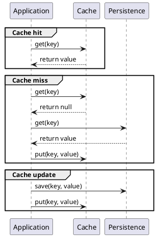

# Onboard

## Message queue and Web service

### Message queue

- If the server fails, the queue persist the message (optionally, even if the machine shutdown).

- When the server is working again, it receives the pending message.

- If the server gives a response to the call and the client fails, if the client didn't acknowledge the response the message is persisted.

- You have contention, you can decide how many requests are handled by the server (call it worker instead).

### Web service

- If the server fails the client must take responsibility to handle the error.

- When the server is working again the client is responsible of resending it.

- If the server gives a response to the call and the client fails the operation is lost.

- If million of clients call a web service on one server in a second, most probably your server will go down.

### References

<https://stackoverflow.com/questions/2383912/message-queue-vs-web-services>

<https://dev.to/matteojoliveau/microservices-communications-why-you-should-switch-to-message-queues--48ia>

## Cache synchronization

